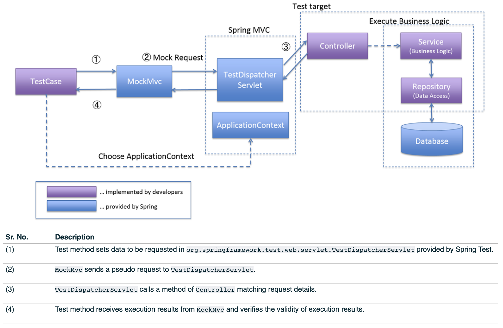
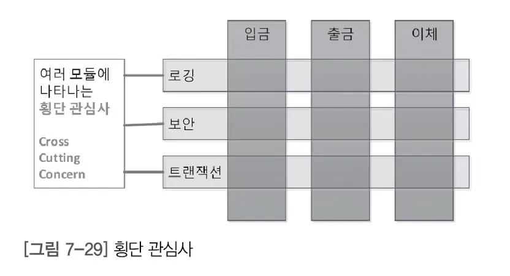
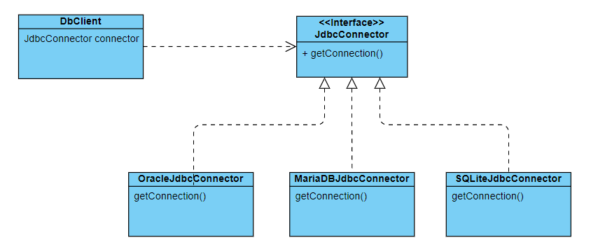
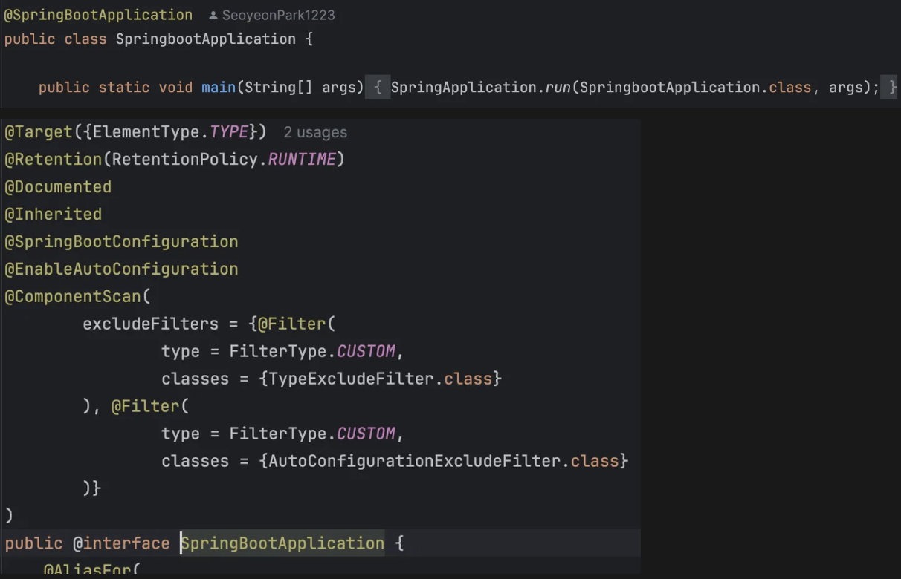
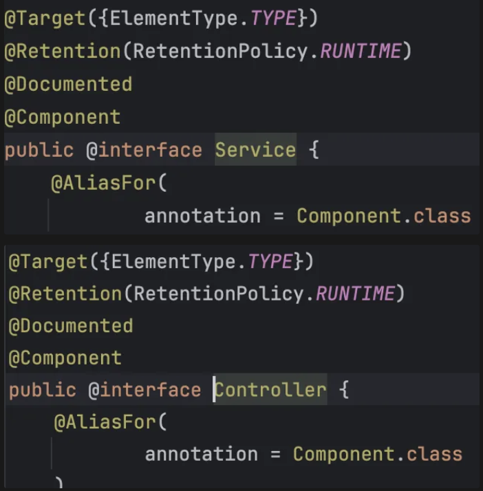
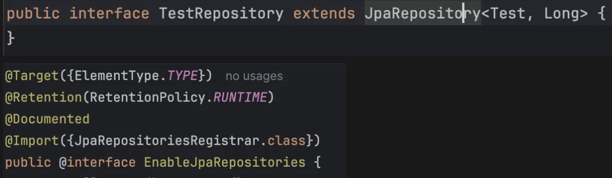
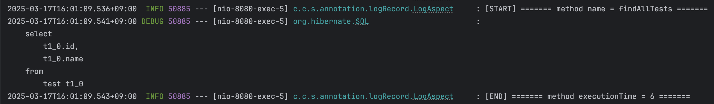

# CEOS Backend Study Week 1

## 1. Spring Tutorial

### Initial Setting

- Project : Gradle - Groovy
- Language : Java 17
- Spring Boot : 3.2.9
- Project Metadata
    - Group : com.ceos21
    - Artifact : springboot
    - Packaging : Jar
    - Java version : 17
- Dependencies
    - Spring Web

### H2 Database

- reference: [reference doc](https://phantom.tistory.com/59)

- 실행: `h2/bin/h2.sh` → `./h2.sh`
- 접속: `8082`앞부분을 `localhost`로 바꾸기
- 최초 서버 실행
    - JDBC URL : `jdbc:h2:~/ceos21`
    - User Name: `sa`
- 이후 서버 실행
    - JDBC URL : `jdbc:h2:tcp://localhost/~/ceos21` → TCP 접속
    - User Name: `sa`
- Dependencies

    ```jsx
    	implementation 'org.springframework.boot:spring-boot-starter-data-jpa'
    	compileOnly 'org.projectlombok:lombok'
    	annotationProcessor 'org.projectlombok:lombok'
    	runtimeOnly 'com.h2database:h2'
    ```

- Application.yml

    ```jsx
    spring:
      datasource:
        url: jdbc:h2:tcp://localhost/~/ceos21
        username: sa
        password:
        driver-class-name: org.h2.Driver
    
      jpa:
        hibernate:
          ddl-auto: create
        properties:
          hibernate:
            format_sql: true
    
    logging:
      level:
        org.hibernate.SQL: debug
    ```


### 테스트 관련

- Dependencies

    ```jsx
    testImplementation('org.springframework.boot:spring-boot-starter-test')
    ```

- `MockMvc`
    - reference: [reference doc](https://terasolunaorg.github.io/guideline/5.4.1.RELEASE/en/UnitTest/ImplementsOfUnitTest/UsageOfLibraryForTest.html#mockmvc)

      1. test method에서 HTTP 기반 요청 보냄
      2. **MockMvc가 TestDispatcherServlet에 가상의 요청 전송 → mock request**
      - Dispatcher servlet은 request를 받아서 맞는 controller를 찾는 역할
      3. TestDispatcherServelet이 Controller에 매칭되는 메소드를 불러서 요청 처리
      4. test method는 mockMvc로부터 결과를 받고 verify를 함
          

  - `@SpringBootTest` + `@AutoConfigureMockMvc` → `webAppContextSettup`기반
  - MockMvc 옵션
    1. `webAppContextSetup`: **Spring의 전체 애플리케이션 컨텍스트(ApplicationContext)를 로드**하여 테스트하는 방식
    2. `standaloneSetup`: **테스트 대상이 되는 Controller만 로드**하여 실행 (mock객체를 직접 주입해야함)
      ```java
      import org.junit.jupiter.api.DisplayName;
      import org.junit.jupiter.api.Test;
      import org.springframework.beans.factory.annotation.Autowired;
      import org.springframework.boot.test.autoconfigure.web.servlet.AutoConfigureMockMvc;
      import org.springframework.boot.test.context.SpringBootTest;
      import org.springframework.http.MediaType;
      import org.springframework.test.web.servlet.MockMvc;
      import static org.springframework.test.web.servlet.result.MockMvcResultMatchers.content;
      import static org.springframework.test.web.servlet.result.MockMvcResultMatchers.status;
      import org.springframework.test.web.servlet.request.MockMvcRequestBuilders;
      import static org.hamcrest.core.IsEqual.equalTo;
    
      @SpringBootTest
      @AutoConfigureMockMvc
      public class HelloControllerTest {
          @Autowired
          private MockMvc mvc;
    
          @DisplayName("DisplayName: 테스트 이름 설정")
          @Test
          public void getHello() throws Exception {
              mvc.perform(MockMvcRequestBuilders.get("/").accept(MediaType.APPLICATION_JSON))
                      .andExpect(status().isOk())
                      .andExpect(content().string(equalTo("Greetings from Spring Boot!")));
          }
      }
    
      ```


## 2. Spring이 지원하는 기술(IoC/DI, AOP, PSA) 조사

### Spring IoC Container

- **객체의 생성과 관리를 개발자가 아닌 Spring 프레임워크가 담당**하는 개념 (Inversion of Control)
- IoC 컨테이너 작동 방식
    1. 객체를 class로 정의
    2. 객체들 간 연관성 지정: Spring Config file / Annotation(`@Component` , `@Configuration`, `@Autowired`, `@Bean`)을 통해 객체들이 어떻게 연결될지(의존성 주입) 지정
    3. IoC 컨테이너가 이 정보를 바탕으로 객체들을 생성하고 필요한 곳에 주입

### Spring DI(Dependency Injection)

- 객체가 생성자 인수, 팩토리 메서드에서 생성되거나 반환된 후에, 객체 인스턴스에 설정된 속성을 통해서만 종속성을 정의하는 프로세스 → **의존성을 외부에서 주입받음**
- 의존성 주입 방식
    1. 생성자 주입 (Constructor Injection) 🤩 → 객체 불변성(immutability) 보장
       - `@RequiredArgsConstructor` 등을 하면 Lombok이 생성자를 자동으로 생성해줌
    2. Setter 주입 (Setter Injection) → 런타임에 의존성 주입
    3. 필드 주입 (Field Injection) → 런타임에 의존성 주입

### AOP(Aspect Oriented Programming)

- **반복 사용되는 로직들을 모듈화 하여 필요할때 호출해서 사용하는 방법**

  

- Proxy 기반 AOP
    - `CGLib`을 이용해서 Proxy 객체를 만들어냄
    - 프록시 객체가 메서드 실행 전후에 부가 기능(횡단 관심사)을 추가 →  이후 실제 객체를 호출


### PSA(Portable Service Abstraction)

- 환경의 변화와 관계없이 일관된 방식의 기술로의 접근 환경을 제공하는 추상화 구조



- `DBClient`에서 어떤 `Connector` 객체에 접근하려해도 모두 같은 추상화된 interface를 거치고 `getConnection()`으로 접근 가능함

## 3. Spring Bean이란? Bean의 life cyle?

### Spring Bean

- **Spring 컨테이너가 관리하는 자바의 객체**
- Spring은 빈(Bean)을 통해 객체를 인스턴스화한 후, 객체 간의 의존 관계를 관리
- 클래스에 `@Component` 어노테이션 추가 → Spring이 자동으로 해당 클래스를 스캔 & Bean으로 등록
- `@Component` → `@Autowired` : **묵시적 빈 정의**
    - 클래스에 어노테이션을 추가 → Autowired로 다른 클래스에서 해당 Bean을 끌어옴
- `@Configuration` → `@Bean` : **명시적 빈 정의**
    - Spring 설정 파일에 Configuration 어노테이션을 추가 → Bean 어노테이션을 붙여 명시적으로 빈을 지정

### Bean Life Cycle

- Spring이 객체(Bean)의 생성과 소멸 및 생명주기를 관리
1. 스프링 IoC 컨테이너 생성 → `ApplicationContext` 로드
2. 스프링 빈 생성 → `@Component`, `@Bean`
3. 의존관계 주입 → `@Autowired`
4. 초기화 콜백 메소드 호출 → `@PostConstruct` (빈 생성 후 바로 실행됨)
5. 사용
6. 소멸 전 콜백 메소드 호출 → `@PreDestroy` (컨테이너 종료 직전 실행됨)
7. 스프링 종료

## 4. Spring Annotation 분석

### 어노테이션의 활용

- Spring에서는 어노테이션을 활용하여 **의존성 주입(DI), AOP, 설정 관리** 등을 수행

### 어노테이션을 통한 Bean 등록

- Spring에서 **어노테이션을 통해 빈을 자동 등록(Bean Registration)** 할 수 있음
1. Spring이 `@ComponentScan`을 실행하여 특정 패키지를 스캔
2. 해당 패키지 내에서 `@Component`, `@Service`, `@Repository`, `@Controller`가 붙은 클래스를 찾음
3. 찾은 클래스를 Spring 컨테이너(ApplicationContext)에 등록 → Bean으로 관리
4. 의존성 주입(DI)을 통해 필요한 곳에 Bean을 자동 연결 (`@Autowired` 어노테이션 사용)

## 5. 단위 테스트 vs 통합 테스트

### 단위 테스트(Unit Test)

- 개별 모듈 또는 클래스의 기능을 검증하는 것에 초점을 맞춘 테스트
- 도구: JUnit 5, Mockito, AssertJ, Spring Boot Test

### 통합 테스트(Integration Test)

- 모듈이 서로 통합되어 상호작용할 때 방생할 수 있는 문제를 찾아내고 해결하는 데 중점을 둔 테스트
- 도구: Spring Boot Test, TestContainers

---
### Component Scan의 플로우
1. `@SpringBootApplication` → `ComponentScan` 어노테이션
  - `@Component`, `@Service`, `@Repository`, `@Controller`가 붙은 객체 등록
  - 
2. `@Service` & `@Controller`
  - `@Service` → `@Component`
  - `@RestController` → `@Controller` → `@Component`
  - 
3. `@Repository`로 등록하지 않았지만 Repository가 Jpa Repository를 상속받는다면 Component로 등록됨
  - SpringBoot에서 `@EnableJpaRepositories`가 설정되어 있음 → `@Import(JpaRepositoriesRegistrar.class)`에서 JpaRepositoriesRegistrar가 JpaRepository를 상속받는 모든 interface를 빈으로 등록
  - 

### Custom Annotation과 AOP를 적용한 로깅
- 사용자 정의 Annotation

    ```jsx
    @Retention(RetentionPolicy.RUNTIME)
    @Target(ElementType.TYPE)
    public @interface SampleAnnotation {}
    ```

  1. `@interface` 선언
  2. `@Retention` (어노테이션을 어느 기간이 유지할건지), `@Target` (어떤 것에 적용할건지) 설정
    - 옵션 reference: [options](https://velog.io/@juhyeon1114/%EC%BB%A4%EC%8A%A4%ED%85%80-Annotation-%EB%A7%8C%EB%93%A4%EA%B8%B0)
  3. `@Aspect` 어노테이션이 붙은 AOP 클래스 생성해서 어노테이션 동작 로직 작성
  4. 커스텀 어노테이션을 적용하고 싶은 곳에 어노테이션을 붙이고 사용

- AOP Dependencies

    ```jsx
    implementation 'org.springframework.boot:spring-boot-starter-aop'
    ```

- reference: [reference doc](https://velog.io/@jjeongdong/Spring-AOP%EB%A5%BC-%ED%99%9C%EC%9A%A9%ED%95%9C-Logging-%EA%B5%AC%ED%98%84)
- 구현 - `@LogRecord` 인터페이스 정의

    ```jsx
    @Target(ElementType.METHOD)
    @Retention(RetentionPolicy.RUNTIME)
    public @interface LogRecord {
    }
    ```

- 구현 - 어노테이션 동작 로직 정의

    ```jsx
    @Aspect
    @Component
    @Slf4j
    public class LogAspect {
    
        @Around("@annotation(com.ceos21.springboot.annotation.logRecord.LogRecord)")
        public Object logRecord(ProceedingJoinPoint joinPoint) throws Throwable {
            MethodSignature signature = (MethodSignature) joinPoint.getSignature();
            Method method = signature.getMethod();
            log.info("[START] ======= method name = {} =======", method.getName());
    
            long startTime = System.currentTimeMillis();
            Object result = joinPoint.proceed();
            long executionTime = System.currentTimeMillis() - startTime;
    
            log.info("[END] ======= method executionTime = {} =======", executionTime);
    
            return result;
        }
    }
    
    ```

- 구현 - 원하는 곳에 어노테이션 적용

    ```jsx
    @Service
    @RequiredArgsConstructor
    @Slf4j
    public class TestService {
        private final TestRepository testRepository;
    
        /* Read All */
        @Transactional(readOnly = true)
        @LogRecord
        public List<Test> findAllTests() {
            return testRepository.findAll();
        }
    }
    ```
- 실행 결과
  - 